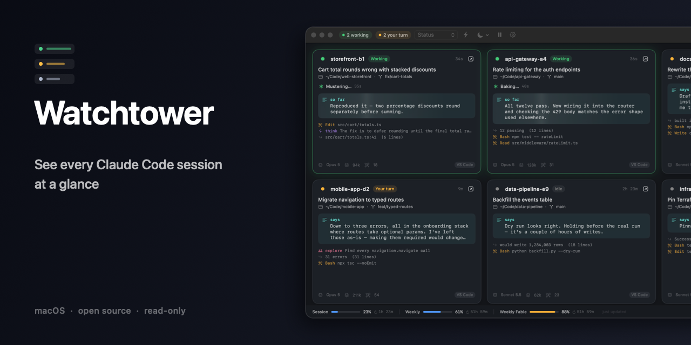
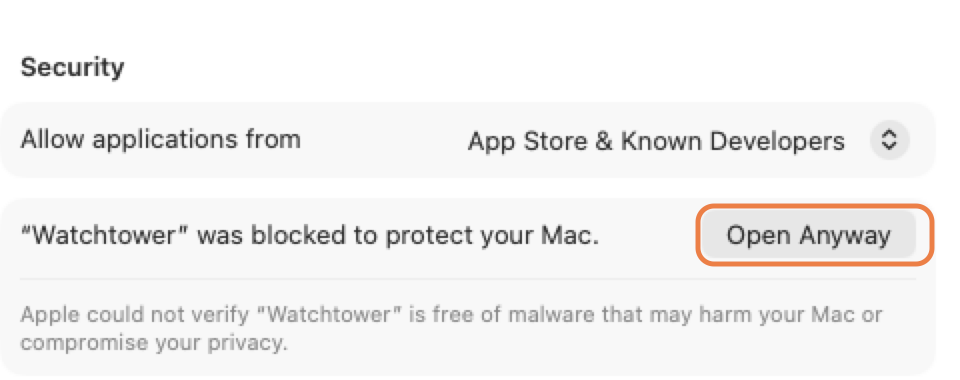

# Watchtower

[](https://github.com/dazecoop/watchtower/actions/workflows/build.yml)


A read-only macOS dashboard that tiles every running Claude session into a
single window, so you can see what each project is doing at a glance.

If you keep several VS Code windows open with Claude Code working in each, you
normally have to cycle through windows and Spaces to find out where things
stand. Watchtower puts them all side by side: what each session is working on,
what it just said, whether it is still running or waiting on you, and how much
of your plan you have used.

It only ever reads. There is no way to send a message to a session from here.



---

## Requirements

- macOS 14 (Sonoma) or later — Apple silicon or Intel
- Claude Code, in VS Code or the CLI

Watchtower reads the files Claude Code already writes to `~/.claude`. If you
have never run Claude Code, there will be nothing to show.

## Install

<a href="https://github.com/dazecoop/watchtower/releases/latest">
  
</a>

1. Download `Watchtower-1.0.0.dmg` from the
   [latest release](https://github.com/dazecoop/watchtower/releases/latest).
2. Open it and drag **Watchtower** into **Applications**.
3. Launch it.

### First launch

macOS will block it the first time and say it *"could not verify Watchtower is
free of malware"*. That is expected, nothing was detected, and you only need to
clear it once — see [the FAQ below](#macos-says-it-could-not-verify-watchtower-is-free-of-malware-is-something-wrong)
for what the message actually means.

1. Try to open Watchtower. macOS blocks it.
2. Open **System Settings → Privacy & Security** and scroll to **Security**.
3. Click **Open Anyway**, then confirm.



On older versions of macOS you could right-click the app and choose **Open**
instead. That shortcut no longer works for this kind of block, so use System
Settings.

### Giving it Accessibility access (optional)

Only needed for the **reveal** button that jumps to a session's editor window.
Everything else works without it. A banner appears in the app with a button
that takes you to the right place, or:

**System Settings → Privacy & Security → Accessibility** → add Watchtower.

If Watchtower is already listed but the banner persists, remove the entry with
the **–** button and add it again. An old entry made against a previous build
no longer matches.

---

## Reading the dashboard

Each session gets a tile:

- **Name and status.** Green *Working* means Claude is mid-turn. Amber *Your
  turn* means it has finished and is waiting on you. Grey *Idle* means nothing
  has happened for half an hour.
- **Title** is the summary Claude Code generates for the session, with the
  project folder and git branch beneath it.
- **Thinking indicator** appears while a turn is running, counting from the
  last thing the session did.
- **The highlighted block** is Claude's most recent prose — the same thing you
  would read in the chat panel. While the turn is still running it shimmers and
  is labelled *so far*, because it is the latest line rather than the last one.
- **Below that** is a live feed of recent steps: tool calls, their output, and
  anything you sent.
- **The footer** shows the model, context tokens in flight, and how many tools
  the session has run.

### Usage

The strip along the bottom shows your plan limits — session, weekly, and any
model-specific weekly limit — with a meter, a percentage and a reset countdown.
Meters turn amber past 75% and red past 90%.

These figures come from the cache Claude Code keeps locally. Watchtower never
contacts Anthropic itself, so the numbers refresh when Claude Code refreshes
them. If nothing has updated them for half an hour the strip dims rather than
presenting stale numbers as current.

### Jumping to a session

The **⬀** button on each tile focuses the editor window running that session,
switching Spaces if the window is on another desktop. It never opens a new
window or file.

Window titles are the only handle macOS gives for this, so matching is by
folder name. When it cannot tell which window you mean, the button becomes a
picker — choose once and it is remembered for that project. Right-click a
resolved button to re-link it.

One wrinkle: a VS Code window with **no folder open** names itself after
whichever file is in front, so its title changes as you switch tabs and a saved
link to it will stop resolving. Windows opened on a folder or workspace are
stable.

---

## Settings (⌘,)

| | |
| --- | --- |
| **Theme** | Six themes. *System*, *Light* and *Dark* use macOS vibrancy, so your wallpaper shows faintly through. *Slate*, *Midnight* and *Nocturne* are opaque — nothing bleeds through. |
| **Columns** | Dynamic, or a fixed 1–4. Dynamic fits as many tiles as the window allows. |
| **Render markdown** | Show `**bold**` and backticks as formatting rather than raw syntax. |
| **Thinking indicator** | Turn the animated status off if you prefer it still. |
| **Notify when a session needs you** | A notification the moment a session stops working and starts waiting on your reply. The most useful setting here when several are running. |
| **Menu bar status** | Off by default. Adds a working/waiting count to the menu bar with a jump-to menu. |

The toolbar also has a filter field for narrowing by name, project or title,
and a sort control: by status, most recent, or project.

### Keyboard

| | |
| --- | --- |
| `⌘R` | Refresh now |
| `⌘P` | Pause / resume live updates |
| `⌘L` | Show active sessions only |
| `⌘,` | Settings |

---

## A note on tile order

Tiles hold their position while work is happening. If they re-sorted on every
update, active sessions would swap places constantly and the grid would be
unreadable. The order is only rewritten once nothing has moved for 30 seconds,
or immediately when you change the sort or filter yourself. New sessions are
added at the end rather than pushed into the middle.

## Privacy

Everything stays on your machine: Watchtower reads local files under
`~/.claude` and makes no network requests of any kind. See the FAQ for
[what it does and does not touch](#does-it-send-my-code-or-conversations-anywhere),
and how to verify that yourself.

## FAQ

### macOS says it could not verify Watchtower is free of malware. Is something wrong?

No, and nothing was found. That message does not mean macOS scanned the app and
detected something — it means the opposite. It has **not** been scanned, so
macOS cannot vouch for it and says so in strong terms.

The check it failed is **notarisation**: uploading the app to Apple to be
scanned and stamped. That requires a paid Apple Developer account, which this
project does not have. Every app distributed outside the App Store without one
produces this same warning, regardless of what it does.

If you would rather not take that on trust, you do not have to:

- **Read the source.** It is all here, and it is small — under 2,000 lines of
  Swift with no third-party dependencies.
- **Check it cannot phone home.** There are no networking APIs anywhere in
  `Sources/`, and the compiled binary links zero networking symbols. You can
  confirm that yourself:
  ```bash
  nm -u /Applications/Watchtower.app/Contents/MacOS/Watchtower | grep -ci "CFNetwork\|NSURLSession"
  # 0
  ```
- **Build it yourself** and skip the download entirely — `./build.sh`, then the
  warning never appears, because an app you built locally is not quarantined.

### Why does it need Accessibility access?

Only for the reveal button that jumps to a session's editor window. macOS
treats controlling another app's windows as an accessibility action, so there
is no way to offer it without the permission. Decline it and everything else
works; the button simply turns into a lock.

### Does it send my code or conversations anywhere?

No. It reads files under `~/.claude` that Claude Code has already written, and
that is all. Nothing is uploaded, and there is no telemetry or analytics. Plan
usage figures come from a cache Claude Code keeps on disk, not from a request
to Anthropic.

### Can it interfere with my sessions?

No. Every file is opened read-only, and the app has no way to send input to a
session. The worst it can do is show you something out of date.

## Troubleshooting

**No sessions appear.** Watchtower only lists sessions whose process is still
running. Check that Claude Code is actually open in a project.

**The reveal button is a lock icon.** Accessibility access has not been granted
— see above.

**The reveal button opens a picker every time.** The window it was linked to
has changed its title. Pick it again, or open that VS Code window on a folder
so its title stays put.

**Usage strip is dim or missing.** No Claude Code session has refreshed the
usage cache recently. It fills in once one does.

## Building from source

See [DEVELOPING.md](DEVELOPING.md).

## Licence

MIT
