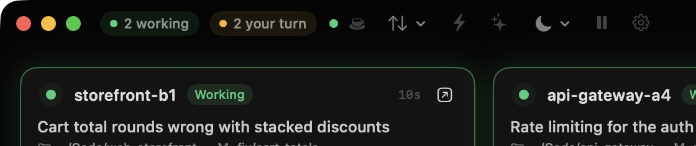
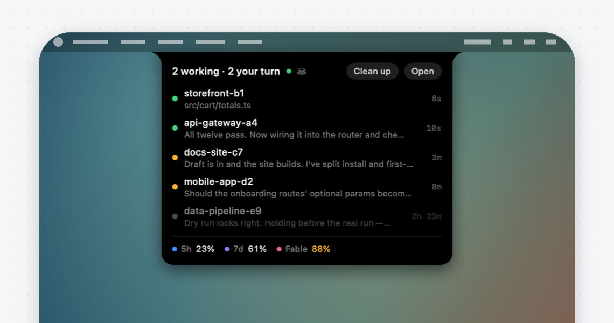
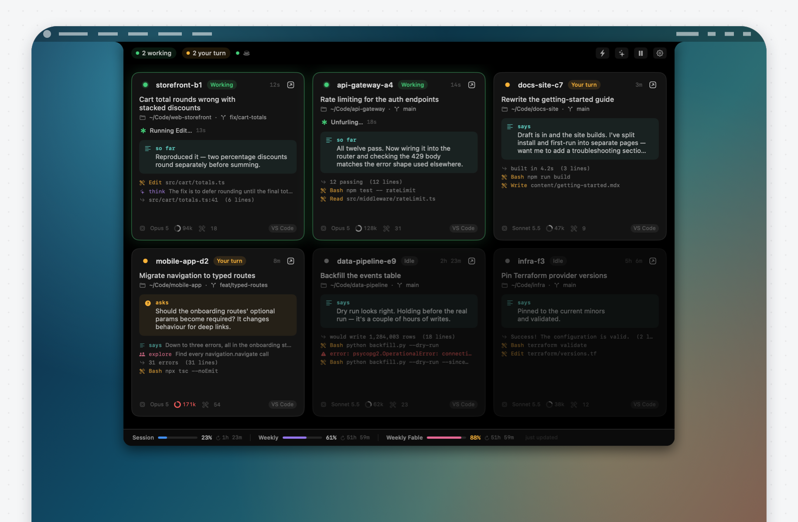

[](https://github.com/dazecoop/watchtower/actions/workflows/build.yml)


A read-only macOS dashboard that tiles every running Claude session into a
single window, so you can see what each project is doing at a glance.

If you keep several VS Code windows open with Claude Code working in each, you
normally have to cycle through windows and Spaces to find out where things
stand. Watchtower puts them all side by side: what each session is working on,
what it just said, whether it is still running or waiting on you, and how much
of your plan you have used.

It only ever reads. There is no way to send a message to a session from here.

When you don't need the whole dashboard, there is the **notch**: a small black
readout that sits flush against a screen edge, showing plan usage and whether
anything is running. Click it to bring the dashboard back — or have it swell
open in place, Dynamic Island style, into either a summary of the fleet or the
entire dashboard, without a window ever coming forward. With the notch on,
Watchtower can run without a Dock icon at all.


---

## What it does

**Sees every session at once.** One tile per running Claude Code session:
what it is working on, the last thing it said, whether it is mid-turn or
waiting on you, and how full its context window is. Click a tile for the whole
feed.

**Tells you when it's your turn.** A tile goes amber the moment a session stops
and waits on you — including when Claude stops to *ask* you something, which
Claude Code itself still counts as busy. A notification goes out, the Dock icon
gets a badge, and clicking the notification jumps to that editor window.

**Keeps the Mac awake while Claude works.** Optional. A long run shouldn't
stall because the machine dozed off, so Watchtower holds off idle sleep while
any session is mid-turn and lets go the moment none is. The cup in the toolbar
is lit while it is holding and dimmed while it is merely armed. See
[keeping the Mac awake](#keeping-the-mac-awake).

**Checks the internet actually works.** Optional. A dot in the toolbar and the
notch: green when the internet is reachable, amber when you are connected to a
network but nothing answers, red when there is no connection. The amber case is
the one macOS is quietest about and the one that wastes the most time. See
[connection check](#connection-check).



**Glows the screen edge while something's working.** Optional. A thin band of
colour around every screen, fading smoothly in from the true edge — visible
even when Watchtower isn't the window in front of you. On a display with HDR
headroom the sweep's peak renders as genuine Extended Dynamic Range, not just
a clamped white. Settings → Screen Glow has a one-click demo, so you can see
it without waiting for a session to start working.

**Lives in the notch, the menu bar, or neither.** A small black readout on a
screen edge that swells open into a summary of the fleet or the whole
dashboard, without a window coming forward; a menu bar item with a jump-to
list and your plan limits; or run it with no Dock icon at all.



**Shows your plan usage.** Session, weekly and model-scoped limits with meters,
percentages and reset countdowns, and an optional poll to keep them current.

It only ever reads. There is no way to send a message to a session from here,
and out of the box it makes no network requests at all.

---

## Requirements

- macOS 14 (Sonoma) or later — Apple silicon or Intel
- Claude Code, in VS Code or the CLI

Watchtower reads the files Claude Code already writes to `~/.claude`. If you
have never run Claude Code, there will be nothing to show.

## Install

<a href="https://github.com/dazecoop/watchtower/releases/latest">
  
</a>

1. Download `Watchtower-1.5.0.dmg` from the
   [latest release](https://github.com/dazecoop/watchtower/releases/latest).
2. Open it and drag **Watchtower** into **Applications**.
3. Launch it.

### First launch

macOS will block it the first time and say it *"could not verify Watchtower is
free of malware"*. That is expected, nothing was detected, and you only need to
clear it once — see [the FAQ below](#macos-says-it-could-not-verify-watchtower-is-free-of-malware-is-something-wrong)
for what the message actually means.

1. Try to open Watchtower. macOS blocks it.
2. Open **System Settings → Privacy & Security** and scroll to **Security**.
3. Click **Open Anyway**, then confirm.


On older versions of macOS you could right-click the app and choose **Open**
instead. That shortcut no longer works for this kind of block, so use System
Settings.

### Giving it Accessibility access (optional)

Only needed for the **reveal** button that jumps to a session's editor window.
Everything else works without it. A banner appears in the app with a button
that takes you to the right place, or:

**System Settings → Privacy & Security → Accessibility** → add Watchtower.

If Watchtower is already listed but the banner persists, remove the entry with
the **–** button and add it again. An old entry made against a previous build
no longer matches.

---

## Reading the dashboard

Each session gets a tile:

- **Name and status.** Green *Working* means Claude is mid-turn. Amber *Your
  turn* means it has finished and is waiting on you. Grey *Idle* means nothing
  has happened for half an hour — and an idle tile keeps fading the longer it
  stays quiet, so an hour's silence and a day's don't look alike.
- **Title** is the summary Claude Code generates for the session, with the
  project folder and git branch beneath it.
- **Thinking indicator** appears while a turn is running, counting from the
  last thing the session did.
- **The highlighted block** is Claude's most recent prose — the same thing you
  would read in the chat panel. While the turn is still running it shimmers and
  is labelled *so far*, because it is the latest line rather than the last one.
- **Below that** is a live feed of recent steps: tool calls, their output, and
  anything you sent.
- **The footer** shows the model, context tokens in flight, and how many tools
  the session has run. The ring beside the token count is how much of the
  model's context window is in use; it turns amber past 70% and red past 85%,
  which is about where Claude Code compacts the conversation automatically.

A few things the tile will tell you without being asked:

- **While a tool is running**, the thinking indicator names it — *Running
  Bash… 45s* — instead of a gerund, so a long command reads as what it is.
- **When Claude stops to ask you something** (a question, or a plan waiting
  for approval) the tile turns amber and reads *Your turn*, even though Claude
  Code still counts the session as busy. The question itself is the
  highlighted block.
- **A tool call that failed** shows its line in red.

### Looking closer

Click a tile for the inspector: the whole feed Watchtower has for that
session, with timestamps and full lines, plus the figures the footer only
hints at — context used of the window available, how long the session has
been open, prompts, tool calls, output tokens, the Claude Code version. Hover a
line to unclip it; text is selectable. The footer reveals the project folder
or the transcript in Finder, or copies the project path, the session id, or
the transcript path.

Right-click a tile for the same actions without opening anything, plus
**Open in Terminal** and **Hide Until It Stirs**, which does for one idle
session what Clean up does for all of them.

### Usage

The strip along the bottom shows your plan limits — session, weekly, and any
model-specific weekly limit — with a meter, a percentage and a reset countdown.
Each limit keeps its own colour, the same one it has in the notch. The
percentage turns amber past 75% and red past 90%.

By default these figures come from a cache Claude Code keeps on disk, and
Watchtower contacts nobody. The catch is that Claude Code only refreshes that
cache when something inside it asks for the numbers — rendering `/usage` is
exactly that — and nothing asks on a timer. A session can work for an hour while
the cache sits where it was, which is why running `/usage` makes the figures
jump.

Rather than present that as current, Watchtower says so. If nothing has
refreshed the figures for half an hour, the strip and the notch's arcs dim. And
once a limit's window has run out, its percentage describes a window that has
already rolled over, so it shows a dash instead of a number until a fresh figure
arrives.

### Keeping the figures current

Optional, off by default. **Settings → Behaviour → Plan usage** turns on a poll
that asks Anthropic for your limits directly, every 1, 5, 15 or 30 minutes.
Turn it on and the numbers stop drifting.

To do that it reads the login Claude Code has already stored — the same
credential, from the same keychain item, read the same way Claude Code reads it.
What it will not do:

- **It never changes that login.** Not even to renew it. Renewing means rotating
  a refresh token that Claude Code also owns, and two apps rotating the same
  token can race in a way that signs you out. If the login has expired,
  Watchtower polls nothing and says so in Settings until Claude Code renews it
  for you, which it does the next time you use it.
- **It never sends the token anywhere but Anthropic.** The address is fixed in
  the source and redirects are refused, so there is no response that can
  redirect the credential somewhere else.
- **It never stores or logs it.** The token is held for one request and dropped.

Leave the setting off and none of that happens — no credential is read and no
request is made.

### Clearing idle sessions

Sessions you have finished with pile up. **Clean up** (the ✨ in the toolbar,
in the notch's header, or `⇧⌘K`) hides every idle session from the app.

It hides them here and nothing more — the sessions themselves are untouched,
exactly as read-only as everything else Watchtower does. Any of them that
stirs comes straight back on its own, and so does anything that starts later.
The button turns into **↶** to bring them all back at once.

This is not the same as the **⚡** filter, which hides idle sessions for as
long as it is on. Clean up clears the ones in front of you now and leaves the
next one alone.

## Watching over the machine

Two optional settings that reach beyond the window. Both are off by default,
both are a single toggle under **Settings → Power & Network**, and both show
their state in the toolbar and in the notch's header.

### Keeping the Mac awake

With it on, Watchtower holds off idle sleep
while a session is mid-turn, so a long run doesn't stall because the machine
dozed off. A small cup icon sits beside the connection dot: lit while it is
holding, dimmed while it is merely armed.

It lets go the moment nothing is working, so an idle Mac sleeps exactly as it
normally would. It takes the same power assertion as `caffeinate -i`, so the
display still sleeps on its usual schedule and closing the lid still suspends —
only idle system sleep is deferred. Pausing updates releases it too, since a
paused Watchtower has stopped watching what it would be holding on for.

### Connection check

Turn it on and a dot appears in the toolbar and the notch:

| | |
| --- | --- |
| 🟢 Green | The internet is working |
| 🟡 Amber | Connected to a network, but nothing is answering — a captive portal, a dead router, DNS blocked, a VPN half-way up |
| 🔴 Red | No network connection at all |

It tells the last two apart because they need different things from you: a
Wi-Fi icon showing full bars while nothing loads is the case most worth
catching, and the one macOS itself is quietest about.

Every 15 seconds it opens a connection to one public DNS resolver — Cloudflare,
Google, Quad9 and OpenDNS in rotation — notes whether it opened, and closes it.
Nothing is sent and nothing is read. A single failure is not treated as an
outage: it tries a second, different resolver before changing the dot.

## Getting around

### Jumping to a session

The **⬀** button on each tile focuses the editor window running that session,
switching Spaces if the window is on another desktop. It never opens a new
window or file.

Window titles are the only handle macOS gives for this, so matching is by
folder name. When it cannot tell which window you mean, the button becomes a
picker — choose once and it is remembered for that project. Right-click a
resolved button to re-link it.

One wrinkle: a VS Code window with **no folder open** names itself after
whichever file is in front, so its title changes as you switch tabs and a saved
link to it will stop resolving. Windows opened on a folder or workspace are
stable.

### The notch

Turn it on in Settings and a small black readout sits flush against a screen
edge of your choosing, above other windows and on every Space.

It shows one ring per plan limit — each in the same colour it has in the usage
bar — the most pressing percentage underneath, and the Claude mark in the
middle. A green ring circles the mark while any session is mid-turn. Hover for
the full breakdown: counts, every limit, and what the busiest session is doing.

Click it to bring Watchtower forward. Drag it to slide it along its edge.

It sweeps out of the screen edge and back again, MacBook-notch style, and you
set how far. Slide it into a screen corner and it picks up a second sweep into
the edge it has just met, so it sits in the corner rather than curving away
from it. The sweep can be turned off entirely.

#### Expanding in place

Rather than bringing the window forward, the notch can swell open where it
sits. It grows out of whichever edge it is docked to, about the point it is
parked at, and slides back onto the screen instead of off it when it is sitting
in a corner. It closes again when the pointer leaves.

Set it to open on a **click**, or on **hover** with a delay you choose from
instant up to a second. And choose what it opens into:

- **Summary** — a line per session with what it is doing and how long ago, plus
  your plan limits. Click a session to jump to its editor window, *Open* for
  the full window, or click anywhere to close.
- **Full app** — the entire dashboard, tiles and all, inside the notch, with a
  cog for Settings in place of any way back to the window. In this mode the
  notch *is* the app: clicks inside go to the dashboard, so it closes by moving
  away. It always draws on the notch's black rather than your chosen theme,
  since anything lighter reads as a window sitting in the bezel.



**Credit where it's due.** The idea came from
[Codenotch](https://github.com/vinzdg/codenotch), which pins a usage readout to
a screen edge and covers several coding assistants at once — Claude, Cursor,
Codex and others. I used it, liked it, and wanted something that went deeper on
one of them rather than wider across all of them: Watchtower follows individual
Claude Code sessions, so the notch is a way back into a dashboard of what each
session is actually doing. This is a separate implementation written against
that goal, not a port of theirs. If you want one widget covering several
assistants' usage side by side, Codenotch is the better tool.

---

## A note on tile order

Tiles hold their position while work is happening. If they re-sorted on every
update, active sessions would swap places constantly and the grid would be
unreadable. The order is only rewritten once nothing has moved for 30 seconds,
or immediately when you change the sort or filter yourself. New sessions are
added at the end rather than pushed into the middle.

## Privacy

Everything stays on your machine: Watchtower reads local files under
`~/.claude`, and out of the box it makes no network requests of any kind and
reads no credentials.

Two optional settings change that, both off until you turn them on:

- [**Keeping the usage figures current**](#keeping-the-figures-current) reads
  the login Claude Code already stores, and asks Anthropic for your plan limits.
  It never changes the login and never sends it anywhere else.
- [**The connection check**](#connection-check) opens a connection to a public
  DNS resolver to see whether it opens. It sends nothing, and never contacts
  Anthropic or this project.

Nothing else leaves the machine under any setting: no code, no conversations, no
telemetry, no analytics. See the FAQ for
[what it does and does not touch](#does-it-send-my-code-or-conversations-anywhere),
and how to verify that yourself.

## FAQ

### macOS says it could not verify Watchtower is free of malware. Is something wrong?

No, and nothing was found. That message does not mean macOS scanned the app and
detected something — it means the opposite. It has **not** been scanned, so
macOS cannot vouch for it and says so in strong terms.

The check it failed is **notarisation**: uploading the app to Apple to be
scanned and stamped. That requires a paid Apple Developer account, which this
project does not have. Every app distributed outside the App Store without one
produces this same warning, regardless of what it does.

If you would rather not take that on trust, you do not have to:

- **Read the source.** It is all here, and it is small — around 5,000 lines of
  Swift with no third-party dependencies.
- **Check it cannot phone home.** There are no networking APIs anywhere in
  `Sources/`, and the compiled binary links zero networking symbols. You can
  confirm that yourself:
  ```bash
  nm -u /Applications/Watchtower.app/Contents/MacOS/Watchtower | grep -ci "CFNetwork\|NSURLSession"
  # 0
  ```
- **Build it yourself** and skip the download entirely — `./build.sh`, then the
  warning never appears, because an app you built locally is not quarantined.

### Why does it need Accessibility access?

Only for the reveal button that jumps to a session's editor window. macOS
treats controlling another app's windows as an accessibility action, so there
is no way to offer it without the permission. Decline it and everything else
works; the button simply turns into a lock.

### Does it send my code or conversations anywhere?

No. It reads files under `~/.claude` that Claude Code has already written, and
that is all. Nothing is uploaded, and there is no telemetry or analytics. Plan
usage figures come from a cache Claude Code keeps on disk, not from a request
to Anthropic.

Two optional settings use the network, both off by default, and neither sends
anything of yours. The [connection check](#connection-check) opens a TCP
connection to port 53 on a public DNS resolver and closes it — no request sent,
no response read. [Keeping the usage figures current](#keeping-the-figures-current)
asks Anthropic for your plan limits, authenticated with the login Claude Code
already stores; it sends your credential to Anthropic, who issued it, and to
nowhere else, and it never alters it. You can watch both with
`nettop -p Watchtower`, or leave them off.

### Can it interfere with my sessions?

No. Every file is opened read-only, and the app has no way to send input to a
session. The worst it can do is show you something out of date.

## Troubleshooting

**No sessions appear.** Watchtower only lists sessions whose process is still
running. Check that Claude Code is actually open in a project.

**The reveal button is a lock icon.** Accessibility access has not been granted
— see above.

**The reveal button opens a picker every time.** The window it was linked to
has changed its title. Pick it again, or open that VS Code window on a folder
so its title stays put.

**Usage strip is dim or missing.** No Claude Code session has refreshed the
usage cache recently. It fills in once one does.

**A tile says *Your turn* while the editor says it is still working.** Claude
has stopped to ask you something — look for the amber *asks* block. Claude
Code counts the session as busy until you answer; Watchtower counts it as
yours.

## Building from source

See [DEVELOPING.md](DEVELOPING.md).

## Licence

MIT
